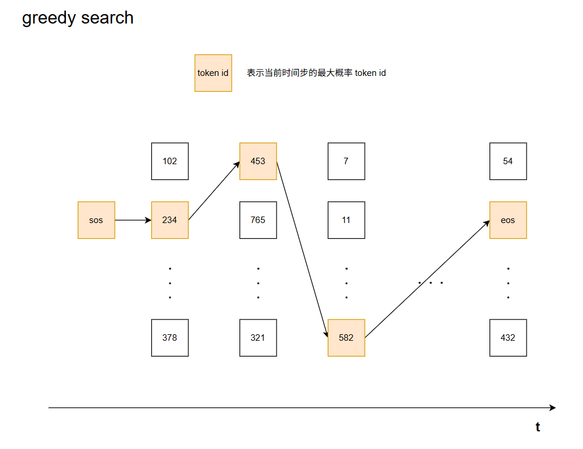
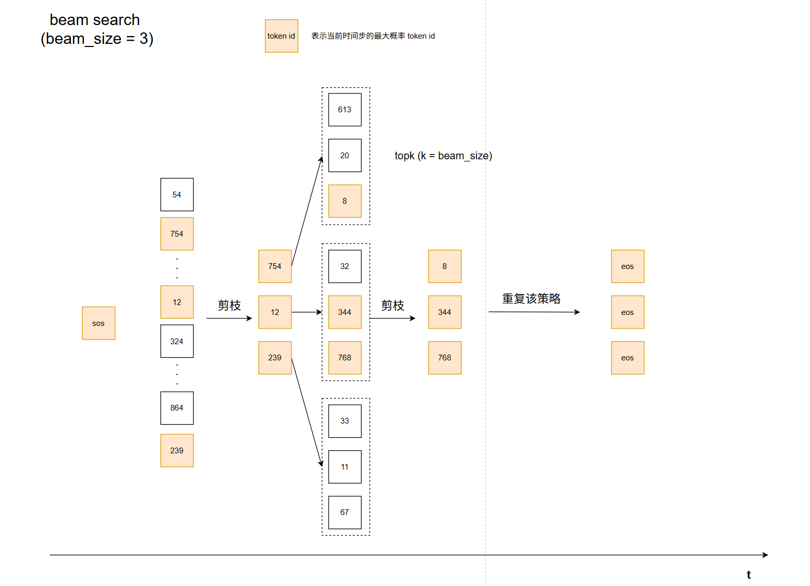
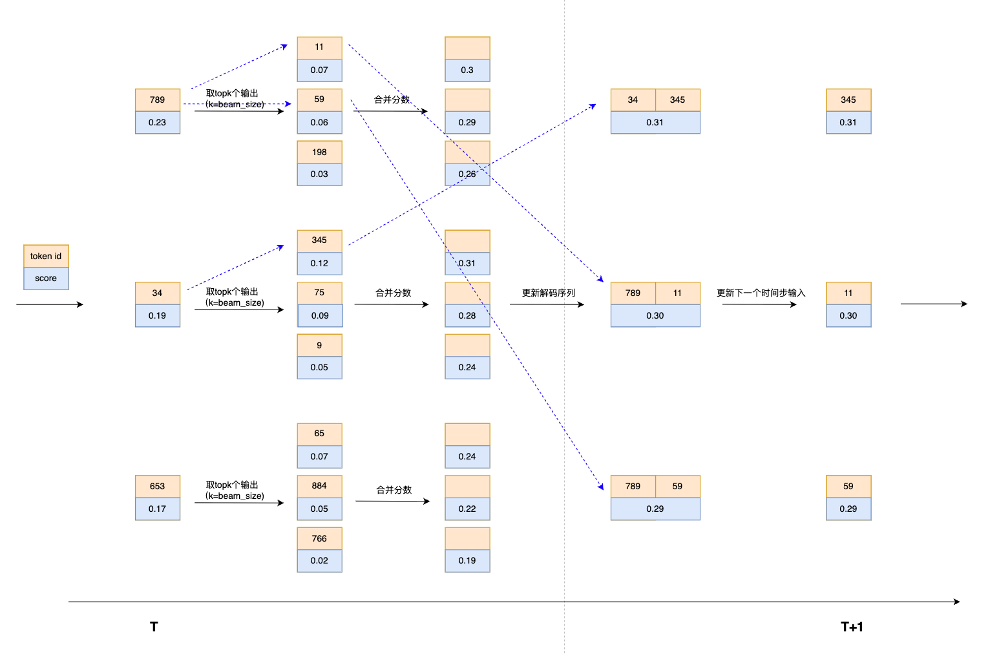
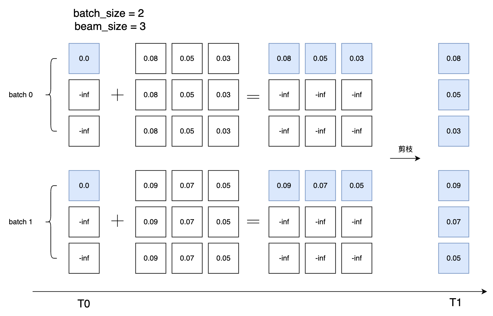

# batch-beam-search

- [batch-beam-search](#batch-beam-search)
  - [和 greedy search 的异同](#和-greedy-search-的异同)
  - [beam search](#beam-search)
    - [1. decode 的初始化工作](#1-decode-的初始化工作)
    - [2. 当前时间步的剪枝](#2-当前时间步的剪枝)
    - [3. 结束解码](#3-结束解码)
  - [工程实践](#工程实践)
    - [基于 pytorch 的 batch beam search 实现](#基于-pytorch-的-batch-beam-search-实现)
    - [将 encoder-decoder 模型结构的 torch model 转为 onnx model](#将-encoder-decoder-模型结构的-torch-model-转为-onnx-model)


## 和 greedy search 的异同

在 encoder-decoder 结构或 only-decoder 结构中，在单次时间步的推理计算过程中，batch beam search 和 batch greedy search 没有任何本质- [batch-beam-search](#batch-beam-search)

的区别，本质上都是进行矩阵运算。不同之处体现在每个时间步的推理计算后，进行的路径选择策略。

对于 greedy search，在得到每个时间步的推理结果后，取概率最大的那个 token 作为下一个时间步的输入，重复该策略，直至达到最大解码序列长度或者是某个时间步的最大概率的token为 eos，停止解码。

对于 beam search，对于每个时间步的推理，在每条解码路径上，会取概率最大的 beam size 个 token，然后对于当前时间步，剪枝获取截至到当前时间步，累计得分概率最高的 beam size 个路径，重复该策略，直至达到最大解码序列长度或者是某个时间步剪枝后的最高 beam size 个 token 都是 eos，停止解码。

greedy search 的核心思想是基于贪心的，认为每个时间步选择概率最大的输出作为下一个时间步的输入将会得到最优的解码结果。而 beam search 则是一种在搜索效率和搜索结果之间权衡的搜索策略，认为整个解码序列的综合概率得分最大的才是最优的解码结果，同时为了避免在整个搜索空间上进行搜索造成搜索性能不佳，对于当前时间步，每条搜索路径只在 top beam size 个输出上进行搜索。

**greedy search**



**beam search**



## beam search
greedy search 和 beam search 解码的示例图如上所示。其中 batch beam search 有以下几点细节需要考虑：

### 1. decode 的初始化工作

在 transformer 结构中，decode 的初始 token 一般为 `sos (sos_id)`，对于多语言模型，可能会有其他初始的填充 token，例如 whisper，这里以一般的 `sos` 为例。这里我们假设 batch size  为 2，对于 greedy search，初始的解码序列为 `[sos, sos]`；但是对于 beam search，初始的解码序列应该由 `batch_size * beam_size` 个 `sos` 组成，例如 beam size 为 3，初始的解码序列应该为 `[[sos, sos, sos], [sos, sos, sos]]` ，即对于每个输入，在实际的 beam search 解码过程中，应该是 beam_size 个解码序列。

同理，初始的解码序列 scores 应该为 `[0] * batch_size * beam_size`。对于 greedy search，一个输入，每个时间步只会维护一个解码序列，scores 为每个时间步的输出概率值的累加，因此最终解码序列的 scores 没有实际的意义，因为一个输入在每个时间步中只会有一条路径，最终结果也只有一条路径。而对于 beam search，一个输入在解码过程中会始终维护 beam size 条路径作为下一个时间步输入的输入，因此解码序列的 scores 变得非常重要，scores 会在解码和剪枝过程中动态更新，以维护送入下一个时间步进行解码的始终是最优的 top beam size 个解码序列。

### 2. 当前时间步的剪枝
当前时间步的剪枝就是更新解码序列 scores 的过程，一图胜千言，如下图所示：


### 3. 结束解码
逻辑上，当推理的输出为 eos 时，这条解码序列就完成了解码过程，不在进行推理计算，但对于 batch beam search，每个时间步的推理过程本质上都是矩阵运算，因此在所有解码路径中，当前的时间步的输出中，只要存在一条路径不是 eos，则所有路径都得参与下一个时间步的推理计算，直至某个时间步，所有路径的输出都是 eos，则该 batch 的所有解码序列都完成解码过程。

---

在下一章节的工程实践中，将会对 batch beam search 的一些实现细节进行介绍。

## 工程实践

### 基于 pytorch 的 batch beam search 实现
这里以 [FireRedASR](https://github.com/FireRedTeam/FireRedASR/blob/main/fireredasr/models/module/transformer_decoder.py#L38) 中的实现为例进行介绍。FireRedASR 是小红书开源的ASR模型，在中文上具有非常不错的识别效果，我们使用 [wenet](https://github.com/wenet-e2e/wenet) 对其进行了微调，实现了不错的性能。

这里先贴出 batch beam search 的代码，下面分块逐步介绍其中的实现细节。
```py
def batch_beam_search(self, encoder_outputs, src_masks,
                   beam_size=1, nbest=1, decode_max_len=0,
                   softmax_smoothing=1.0, length_penalty=0.0, eos_penalty=1.0):
    B = beam_size
    N, Ti, H = encoder_outputs.size()
    device = encoder_outputs.device
    maxlen = decode_max_len if decode_max_len > 0 else Ti
    assert eos_penalty > 0.0 and eos_penalty <= 1.0

    # Init
    encoder_outputs = encoder_outputs.unsqueeze(1).repeat(1, B, 1, 1).view(N*B, Ti, H)
    src_mask = src_masks.unsqueeze(1).repeat(1, B, 1, 1).view(N*B, -1, Ti)
    ys = torch.ones(N*B, 1).fill_(self.sos_id).long().to(device)
    caches: List[Optional[Tensor]] = []
    for _ in range(self.n_layers):
        caches.append(None)
    scores = torch.tensor([0.0] + [-self.INF]*(B-1)).float().to(device)
    scores = scores.repeat(N).view(N*B, 1)
    is_finished = torch.zeros_like(scores)

    # Autoregressive Prediction
    for t in range(maxlen):
        tgt_mask = self.ignored_target_position_is_0(ys, self.pad_id)

        dec_output = self.dropout(
            self.tgt_word_emb(ys) * self.scale +
            self.positional_encoding(ys))

        i = 0
        for dec_layer in self.layer_stack:
            dec_output = dec_layer.forward(
                dec_output, encoder_outputs,
                tgt_mask, src_mask,
                cache=caches[i])
            caches[i] = dec_output
            i += 1

        dec_output = self.layer_norm_out(dec_output)

        t_logit = self.tgt_word_prj(dec_output[:, -1])
        t_scores = F.log_softmax(t_logit / softmax_smoothing, dim=-1)

        if eos_penalty != 1.0:
            t_scores[:, self.eos_id] *= eos_penalty

        t_topB_scores, t_topB_ys = torch.topk(t_scores, k=B, dim=1)
        t_topB_scores = self.set_finished_beam_score_to_zero(t_topB_scores, is_finished)
        t_topB_ys = self.set_finished_beam_y_to_eos(t_topB_ys, is_finished)

        # Accumulated
        scores = scores + t_topB_scores

        # Pruning
        scores = scores.view(N, B*B)
        scores, topB_score_ids = torch.topk(scores, k=B, dim=1)
        scores = scores.view(-1, 1)

        topB_row_number_in_each_B_rows_of_ys = torch.div(topB_score_ids, B).view(N*B)
        stride = B * torch.arange(N).view(N, 1).repeat(1, B).view(N*B).to(device)
        topB_row_number_in_ys = topB_row_number_in_each_B_rows_of_ys.long() + stride.long()

        # Update ys
        ys = ys[topB_row_number_in_ys]
        t_ys = torch.gather(t_topB_ys.view(N, B*B), dim=1, index=topB_score_ids).view(N*B, 1)
        ys = torch.cat((ys, t_ys), dim=1)

        # Update caches
        new_caches: List[Optional[Tensor]] = []
        for cache in caches:
            if cache is not None:
                new_caches.append(cache[topB_row_number_in_ys])
        caches = new_caches

        # Update finished state
        is_finished = t_ys.eq(self.eos_id)
        if is_finished.sum().item() == N*B:
            break

    # Length penalty (follow GNMT)
    scores = scores.view(N, B)
    ys = ys.view(N, B, -1)
    ys_lengths = self.get_ys_lengths(ys)
    if length_penalty > 0.0:
        penalty = torch.pow((5+ys_lengths.float())/(5.0+1), length_penalty)
        scores /= penalty
    nbest_scores, nbest_ids = torch.topk(scores, k=int(nbest), dim=1)
    nbest_scores = -1.0 * nbest_scores
    index = nbest_ids + B * torch.arange(N).view(N, 1).to(device).long()
    nbest_ys = ys.view(N*B, -1)[index.view(-1)]
    nbest_ys = nbest_ys.view(N, nbest_ids.size(1), -1)
    nbest_ys_lengths = ys_lengths.view(N*B)[index.view(-1)].view(N, -1)

    # result
    nbest_hyps: List[List[Dict[str, Tensor]]] = []
    for n in range(N):
        n_nbest_hyps: List[Dict[str, Tensor]] = []
        for i, score in enumerate(nbest_scores[n]):
            new_hyp = {
                "yseq": nbest_ys[n, i, 1:nbest_ys_lengths[n, i]]
            }
            n_nbest_hyps.append(new_hyp)
        nbest_hyps.append(n_nbest_hyps)
    return nbest_hyps
```

正如上面贴出代码中的注释，可以将 batch beam search 拆分为以下几个部分展开介绍：
1. 解码的推理前的一些初始化工作。
   对于 encoder-decoder 模型结构，encoder 的输出是 decoder 的初始输入的一部份，还有 `cross_attn_mask`，在上面的代码中为 `src_mask`。此外，还有在推理过程中需要维护的解码序列得分的变量 `scores`、预测序列结果的变量 `ys`，以及用来判断 batch beam search 是否结束的变量 `is_finished`。这些变量在初始化工作都需要构造为 batch_size * beam_size 的大小。

   这里有一个编码细节值得一说，那就是 `scores` 变量的初始化，`scores` 的初始化为 `torch.tensor([0.0] + [-self.INF]*(B-1))` 。首先要知道，第一个时间步输入解码的 token 为 `sos`，也即在同一个 batch 中的 beam size 个解码序列中的第一个时间步的输入都是相同的，因此在第一个时间步的输出中，同一个 batch 中的 beam size 条路径的 top beam size 输出都是相同的，得分也即相同的。然后就是一图胜千言了，看图，结合 debug，多迭代几个时间步就能体会其中的小巧思了。
   

   此外，上面代码中还涉及 `cache` 的初始化，这里的 `cache` 是对 decoder 中每一层输出的缓存，更一般的做法会对 decoder 中每一层的 `self_key` 和 `self_value` 进行缓存，以减少在推理时的计算量。这节不进行展开描述，将在 [torch model 转 onnx model](#将-encoder-decoder-模型结构的-torch-model-转为-onnx-model) 章节进行讨论。

2. 每个时间步的自回归推理。
   模型推理的本质就是输入的矩阵表示和一堆矩阵参数进行计算，然后得到输出的矩阵。当前时间步的输出进行剪枝后作为下一个时间步的输入，如此重复，直至达到退出计算的条件。

3. 剪枝。
   剪枝的目的是从当前时间步推理结果中的 beam_size * beam_size 条路径中选择最优的 beam_size 条路径，作为下一个时间步的的输入（这里指的是同一个 batch）。beam search 中其实也是有贪心的思想，对于同一个 batch 中维护的 beam size 条解码序列，每个时间步中每条解码序列只需要获取 top beam size 个输出，而不需要维护词表大小的输出，即可保证同一 batch 中最优的 beam size 条路径可以被获取。

   1. 首先根据推理的结果概率，获取每条解码路径的 topk 个输出 token 和其对应的概率值。
        ```py
        t_topB_scores, t_topB_ys = torch.topk(t_scores, k=B, dim=1)
        ```
   2. 更新 `t_topB_scores` 和 `t_topB_ys`。
        ```py
        t_topB_scores = self.set_finished_beam_score_to_zero(t_topB_scores, is_finished)
        t_topB_ys = self.set_finished_beam_y_to_eos(t_topB_ys, is_finished)
        ```

        目的是，若其中某些解码序列已经结束预测（在之前时间步的解码序列中已经为 eos），则让当前时间步的预测依然保持为 eos，其对应的 token score 为 0。注意，解码序列的得分是模型推理输出值进行 log_softmax 后的累加值。
        
        ```py
        def set_finished_beam_score_to_zero(self, scores, is_finished):
            NB, B = scores.size()
            is_finished = is_finished.float()
            mask_score = torch.tensor([0.0] + [-self.INF]*(B-1)).float().to(scores.device)
            mask_score = mask_score.view(1, B).repeat(NB, 1)
            return scores * (1 - is_finished) + mask_score * is_finished

        def set_finished_beam_y_to_eos(self, ys, is_finished):
            is_finished = is_finished.long()
            return ys * (1 - is_finished) + self.eos_id * is_finished
        ```
   3. 更新截止当前时间步每条路径的得分，然后进行剪枝。这里的一个编码技巧是，通过下标（`topB_row_number_in_ys`、 `topB_score_ids`）步长（`stride`）来获取最终剪枝后的路径。
        ```py
        # Accumulated
        scores = scores + t_topB_scores

        # Pruning
        scores = scores.view(N, B*B)
        scores, topB_score_ids = torch.topk(scores, k=B, dim=1)
        scores = scores.view(-1, 1)

        topB_row_number_in_each_B_rows_of_ys = torch.div(topB_score_ids, B).view(N*B)
        stride = B * torch.arange(N).view(N, 1).repeat(1, B).view(N*B).to(device)
        topB_row_number_in_ys = topB_row_number_in_each_B_rows_of_ys.long() + stride.long()

        # Update ys
        ys = ys[topB_row_number_in_ys]
        t_ys = torch.gather(t_topB_ys.view(N, B*B), dim=1, index=topB_score_ids).view(N*B, 1)
        ys = torch.cat((ys, t_ys), dim=1)
        ```

4. 更新 cache。在 FireRedASR 的这个版本实现中，cache就是缓存当前时间步 decoder 中每一层的输出。

5. 判断 batch beam search 是否结束。
   ```py
    # Update finished state
    is_finished = t_ys.eq(self.eos_id)
    if is_finished.sum().item() == N*B:
        break
   ```

batch beam search 在实现上需要考虑的细节如上5点所示，在实际的部署优化中，cache 的维护会不同于 FireRedASR 该版本中的实现。相关可以参考 [wenet](https://github.com/wenet-e2e/wenet/blob/main/wenet/transformer/search.py#L250) 和 [sherpa-onnx](https://github.com/k2-fsa/sherpa-onnx/blob/master/scripts/whisper/export-onnx.py#L166) 中的 cache 优化实现。

### 将 encoder-decoder 模型结构的 torch model 转为 onnx model
使用 onnx 模型进行部署一种常见的解决方案，[sherpa-onnx](https://github.com/k2-fsa/sherpa-onnx/blob/master/scripts/whisper/export-onnx.py) 中提供了将 whipser 的 torch model 转为 onnx model 的脚本，可以参考学习。小红书的 FireRedASR-AED-L 和 whisper-large-v3 具有相似的模型结构和参数量，我参考该脚本将 FireRedASR-AED-L 模型成功转为了 onnx 模型，不同之处是，我参考 FireRedASR 中的 batch beam search 实现，实现了转出的 onnx model 支持 batch beam search，而 sherpa-onnx 中 FireRedASR 和 whisper 的 onnx 推理目前都不支持 batch beam search。


